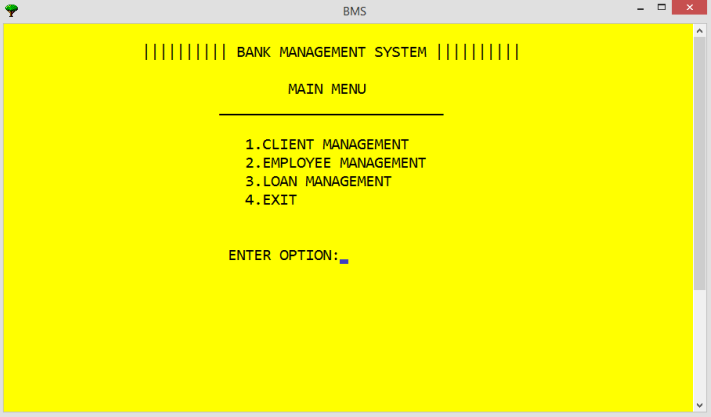
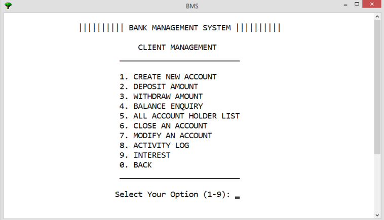
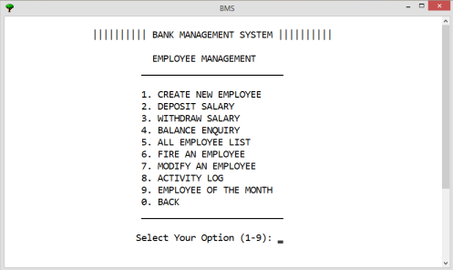
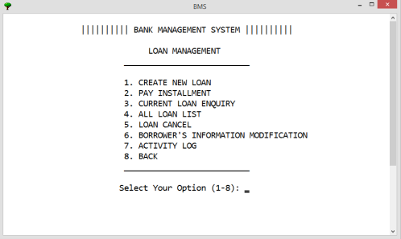

# Bank Management System

A console-based **Bank Management System developed using C++** as part of the **Software Development Lab I (CSE 136)** course at Varendra University, Rajshahi, Bangladesh.

The system is designed to manage clients, employees, and loans through a menu-driven interface. I designed and implemented the system, including account management, transactions, employee management, loan management, activity logging, and an Employee of the Month voting system.

## Features

### Client Management

* Create new bank accounts
* Deposit money
* Withdraw money
* Check account balance
* View all accounts
* Modify account information
* Close accounts
* View activity logs

### Employee Management

* Create new employees
* Deposit salary
* Withdraw salary
* Check salary balance
* View all employees
* Modify employee information
* Fire employees
* View employee activity logs
* Employee of the Month voting system

### Loan Management

* Create new loans
* Make loan installment payments
* Check current loan information
* View all loans
* Cancel loans
* Modify borrower information
* View loan activity logs

## Technology

* **Programming Language:** C++
* **Application Type:** Console-based application
* **Platform:** Windows

## Project Structure

```text
BMS/
├── BMS3.cpp
├── vote.cpp
├── account.dat
├── counter.dat
├── default_Password.txt
├── eaccount.dat
├── ecounter.dat
├── elog.txt
├── laccount.dat
├── lcounter.dat
├── llog.txt
├── log.txt
├── password.dat
└── reference.txt
```

The `.dat` files are used for storing account, employee, loan, and counter information, while the `.log` files are used to maintain activity records.

## Sample Data

All account, employee, loan, password, and transaction data included in this repository are **fictional/sample data** created for testing and demonstration purposes.

No real banking or personal information is used.

## How to Run

### Requirements

* Windows operating system
* A C++ compiler such as MinGW/G++
* The project files and required data files in the same directory

### Compile

Compile the main program using:

```bash
g++ BMS3.cpp -o BMS3
```

Compile the voting system using:

```bash
g++ vote.cpp -o vote
```

### Run

After compilation, run the main program:

```text
BMS3.exe
```

> **Note:** The current version of the application uses Windows-specific functionality and is intended to run on Windows.

The repository includes the sample `.dat`, `.txt`, and `.log` files used by the current version of the application. Keep these files in the same directory as the executable when running the program.

## Project Background

This project was developed as part of the **Software Development Lab I (CSE 136)** course.

The objective was to design and implement a functional software system based on the requirements provided for the course.

**Role:** Software Developer
**Responsibilities:** System Design, Development & Implementation
**Technology:** C++

## Screenshots

### Main Menu



### Client Management



### Employee Management



### Loan Management



## Author

**Md. Samiul Islam**

Developed as a course project for **Software Development Lab I (CSE 136)**.

## Disclaimer

This project is an educational software project and is **not intended for use in a real banking environment**.
